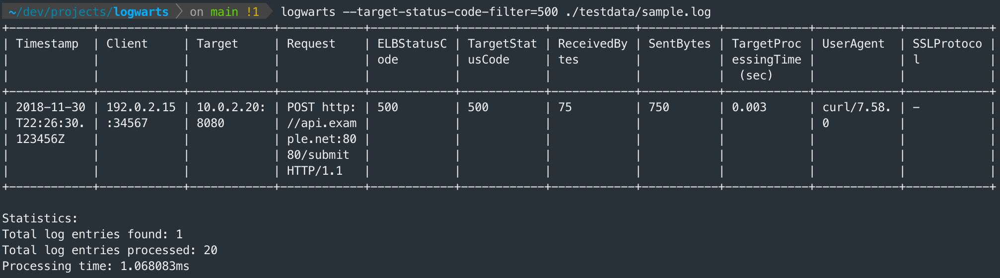

# Logwarts

Welcome to **Logwarts**, an open-source command-line tool designed for efficient and magical processing of AWS Application Load Balancer (ALB) log files. Inspired by the wizarding world, Logwarts aims to bring a bit of magic to your log analysis tasks.

**Hint:** If you have several GB of log data collected over a long period of time, Logwarts can process these logs efficiently without loading all data into memory, thanks to its streaming processing. However, for very large datasets, consider using AWS Athena to query the data.



## Features

- **Easy Parsing**: Quickly parse through various ALB log files with ease
- **Streaming Processing**: Efficiently processes logs without loading everything into memory
- **Advanced Filtering**: Use powerful filtering options to zero in on significant data
- **Customizable Output**: Display results in detailed or simple formats
- **Spellbinding Speed**: Blazingly™ fast processing of large log files
- **AWS ELB S3 Access**: *(Coming Soon)* Parse files directly from S3 to avoid overhead

### Ideas

- SQL-like query language / LogStash-like filtering
- Analytics report export
- Aggregate over multiple log files
- Streaming of log event updates
- Make available via Homebrew

## Prerequisites

To get the most out of Logwarts, ensure that:

- Access logging is enabled on your ALBs
- Log files are available locally or in an S3 bucket you can access

## Getting Started

### Installation

To install Logwarts, you can build it from source using Go. Follow the steps below:

1. **Install go**
    
    You can use `asdf` to install the required language dependencies defined in `.tool-versions` file:
    ```bash
    asdf install
    ```
2. **Clone the repository**

    ```bash
    git clone https://github.com/frederikmartin/logwarts.git
    cd logwarts
    ```
3. **Build the project**

    ```bash
    make build
    ```
    This will create an executable named `logwarts` in the project directory.
4. **Install the executable**
    Symlink the executable to a directory in your `$PATH` (e.g., `/usr/local/bin`):

    ```bash
    make symlink
    ```
    Restart your terminal session and you can start running `logwarts` from anywhere in your terminal.

### Usage

#### Process Local Log Files

Here's a quick example of how to use Logwarts with locally available ALB log files:

```bash
logwarts --limit=5 --url-filter='example\.com' alb-logs/*.log
```

This command parses the specified log files and displays up to 5 log entries where the URL matches the regular expression `example\.com`.

#### Process Log Files from a List (stdin)

If you have a list of log filenames, you can pipe them into Logwarts using the `--input` flag:

```bash
ls alb-logs/*.log | logwarts --input --limit=5 --user-agent-filter='Mozilla'
```

This command reads filenames from `stdin` and displays up to 5 log entries where the User-Agent matches `Mozilla`.

#### Process Gzipped files

Logwarts supports processing gzipped log files without the need to decompress them first:

```bash
ls alb-logs/*.log.gz | logwarts --input
```

#### Filtering by Time Range

You can filter log entries by a specific time range using the `--start` and `--end` options:

```bash
logwarts --start="2018-11-30T22:23:00Z" --end="2018-11-30T23:00:00Z" alb-logs/*.log
```

This command displays log entries within the specified time range.

#### Filtering by Status Codes

Filter by ELB status code:

```bash
logwarts --elb-status-code-filter=200 alb-logs/*.log
```

Filter by Target status code:

```bash
logwarts --target-status-code-filter=404 alb-logs/*.log
```

#### Sorting Entries

You can sort the log entries by `timestamp` or `target-processing-time` in ascending or descending order.

**Sort by Timestamp (Ascending):**

```bash
logwarts --sort-field=timestamp --sort-order=asc alb-logs/*.log
```

**Sort by Target Processing Time (Descending):**

```bash
logwarts --sort-field=target-processing-time --sort-order=desc alb-logs/*.log
```

**Combining Sorting with Other Filters:**

```bash
logwarts --url-filter='example\.com' --sort-field=timestamp --sort-order=desc --entries=10 alb-logs/*.log
```

This command filters entries matching the URL pattern and displays the latest 10 entries sorted by timestamp in descending order.

#### Available Sort Fields and Orders

- **Sort Fields:**
  - `timestamp`
  - `target-processing-time`

- **Sort Orders:**
  - `asc` (ascending)
  - `desc` (descending)

**Note:** Sorting requires collecting all filtered entries into memory. For very large datasets, this may increase memory usage.

#### Display Simple Output

If you prefer a simplified output showing only the timestamp, URL, and User-Agent, use the `--simple` flag:

```bash
logwarts --simple alb-logs/*.log
```

#### Combining Filters

You can combine multiple filters to narrow down the log entries:

```bash
logwarts --start="2018-11-30T22:00:00Z" --end="2018-11-30T23:00:00Z" \  
         --url-filter='secure\.example\.org' \  
         --user-agent-filter='Mozilla' \  
         --elb-status-code-filter=200 \  
         --limit=10 \  
         alb-logs/*.log
 ```

This command displays up to 10 log entries that match all the specified filters.

#### Help

To see all available options, use:

```bash
logwarts --help
```

### Processing AWS ALB Logs from S3

*(Coming Soon)*

While direct S3 processing is in development, you can manually download the logs from S3 and process them locally:

```bash
aws s3 cp s3://your-alb-log-bucket/path/to/logs/ tempdir --recursive
cd tempdir
gunzip \*.gz
logwarts --limit=5 tempdir/\*.log
```

## Example Scenarios

#### Scenario 1: Find Error Entries

To find entries where the ELB or target returned an error status code (e.g., `500`):

```bash
logwarts --elb-status-code-filter=500 --limit=10 alb-logs/*.log
```

#### Scenario 2: Search for Specific User-Agent

To find entries from a specific User-Agent, such as `curl`:

```bash
logwarts --user-agent-filter='curl' --limit=5 alb-logs/*.log
```

#### Scenario 3: Simplified Output for a Time Range

To display a simple list of URLs accessed in the last hour:

```bash
logwarts --start="$(date -u -v -1H +"%Y-%m-%dT%H:%M:%SZ")" --simple alb-logs/*.log
```

## Contributing

Contributions are what make the open-source community such a fantastic place to learn, inspire, and create. Any contributions you make are **greatly appreciated**.

1. Fork the Project
2. Create your Feature Branch (`git checkout -b feature/AmazingFeature`)
3. Commit your Changes (`git commit -m 'Add some AmazingFeature'`)
4. Push to the Branch (`git push origin feature/AmazingFeature`)
5. Open a Pull Request

## License

Distributed under the MIT License. See [LICENSE](./LICENSE) for more information.

